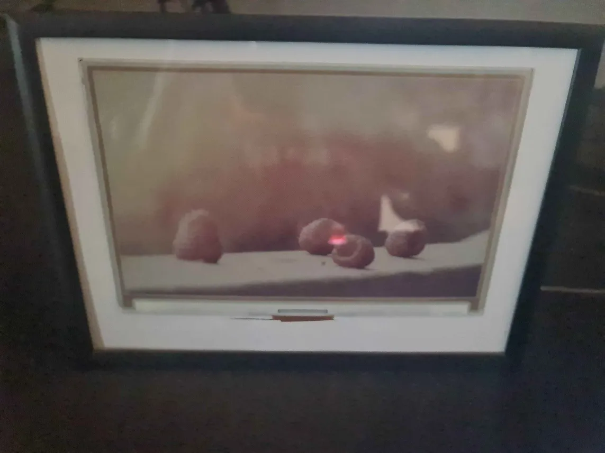

# paper-status

A small project generated from the necessity for a small standalone device to cycle through grafana
dashboards. The project is tested on a Raspberry Pi Zero W and targets the [7.3inch ACeP 7-Color E-Paper E-Ink Display Module](https://www.waveshare.com/7.3inch-e-paper-hat-f.htm).



## Prequisites

- Raspberry Pi Zero W
- [7.3inch ACeP 7-Color E-Paper E-Ink Display Module](https://www.waveshare.com/7.3inch-e-paper-hat-f.htm)
- Raspberry Pi OS Lite
- Docker

## Installation

This project runs in a docker container. You can build the docker image yourself or use the prebuilt image from
ghcr.io/0xc9c3/paper-status:main.

The quickstart.sh script is meant to initially install and update the project.

It will:

- Check if docker is installed
- Pull the latest image from ghcr.io/0xc9c3/paper-status:main
- Install the systemd service
- Start or restart the service

The syntax is as follows:

Parameters:
- $1: The URL of the image endpoint
- $2: The interval in seconds to check for a new image

i.e.

```bash
./quickstart.sh https://your.image.endpoint 600
```


## Considerations

After configuring the script I recommend to put the raspberry pi zero w file system in read-only mode. 
This can be done with i.e. ```sudo raspi-config``` and then performance -> overlay fs **no** -> read-only **yes**.

This should make the system more robust and prevent corruption of the boot partition.

If im happy with the project, actually look regularly at the display and have the time, I would love to create an image using 
[the arm packer builder](https://github.com/mkaczanowski/packer-builder-arm) with the docker image and the configuration
 / parameters embedded. Then the whole card could be read-only and the system would be a lot more robust. Updates would
    be done by flashing a new image. Creating more displays would be as easy as flashing the image to a new SD card.

## License

This project is licensed under the WTFPL license. For more information see the LICENSE file.
